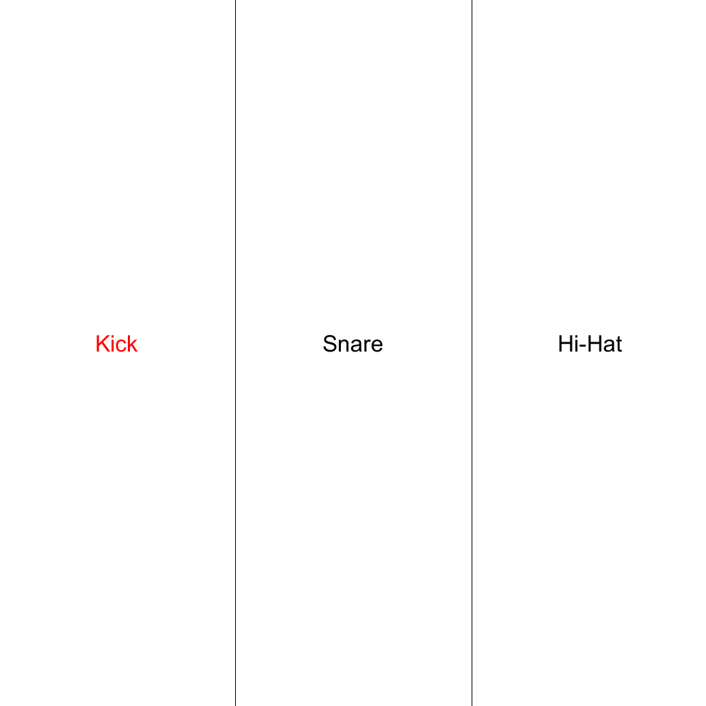

# Summary
This is a simple drum-kit application for Arduino + Processing utilizing the MakerBoard buttons as input triggers for drum samples.
Each button is mapped to a corresponding sample, allowing users to treat the buttons as if they are drums themselves.

The program includes a visual display indicating which sample is currently being played as additional feedback.

- Button 1: Kick Drum
- Button 2: Snare Drum
- Button 3: Hi-Hat

## Arduino
The MakerBoard buttons trigger input signals that are sent through the serial port as output.

## Processing
Processing accepts this serial input, maps it to a value which corresponds to the sample mapped to that button using the processing.sound library.
Dependent on the input that it receives, it alters a visualization to indicate which sample is currently being played.

## Visualization:

